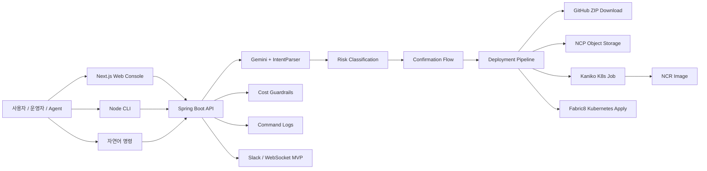

# K-Le-PaaS

K-Le-PaaS는 자연어와 CLI 명령을 감사 가능하고 위험도 분류된 Kubernetes 운영 작업으로 변환하는 Agent-safe PaaS control plane입니다.

> K-Le-PaaS is an agent-safe Kubernetes control plane that converts natural language and CLI commands into auditable, risk-classified infrastructure operations.

## 개요

K-Le-PaaS는 Web, CLI, API, 자연어 명령을 하나의 Spring Boot 백엔드 제어면으로 연결해 Kubernetes 애플리케이션 배포와 운영을 수행하는 플랫폼입니다. 자연어를 곧바로 셸 명령으로 실행하지 않고, 먼저 구조화된 intent로 해석한 뒤 위험도를 분류하고, 필요한 경우 사용자 확인을 받은 다음 백엔드 서비스가 통제된 방식으로 실행합니다.

주요 기능은 다음과 같습니다.

- GitHub OAuth 로그인과 GitHub App 기반 저장소 접근
- 저장소 등록과 배포 설정 관리
- GitHub ZIP 소스 다운로드와 재패키징
- NCP Object Storage 업로드
- Kaniko Kubernetes Job 기반 이미지 빌드
- commit SHA 기반 이미지 태그와 NCR push
- Fabric8 Kubernetes Client 기반 Deployment, Service, Ingress apply
- Gemini 2.5 Flash 기반 자연어 명령 해석
- LOW / MEDIUM / HIGH 위험도 분류
- 위험 명령에 대한 사용자 확인 flow
- Web console과 Node 기반 CLI 제어면
- CLI 비용 plan, diff, explain, check
- Slack / WebSocket 배포 알림 MVP
- GitHub push webhook 기반 자동 배포 MVP

## 현재 상태

| 영역 | 상태 | 설명 |
|---|---|---|
| Web console | 구현 MVP | Next.js 기반 대시보드, 배포, GitHub, 명령, 모니터링, 설정 UI |
| Backend API | 구현 MVP | 인증, 배포, NLP, 비용, webhook, CLI 인증 API |
| GitHub OAuth | 구현 | OAuth code exchange와 JWT 발급 구현 |
| GitHub App source access | 구현 MVP | Installation token과 source ZIP 다운로드 경로 구현 |
| NCP Object Storage upload | 구현 MVP | AWS SDK v2 S3 호환 업로드 경로 구현 |
| Kaniko image build | 구현 MVP | Kubernetes Job 기반 빌드 경로 구현 |
| Kubernetes deploy | 구현 MVP | Fabric8 server-side apply로 Deployment, Service, Ingress 반영 |
| Commit SHA image tags | 구현 | 짧은 commit SHA를 이미지 태그로 사용 |
| Natural language operations | 구현 MVP | Gemini client, intent parser, dispatcher, command log, confirmation flow 구현 |
| Risk confirmation | 구현 MVP | MEDIUM / HIGH 명령은 확인 후 실행 |
| CLI | 구현 MVP | `auth`, `ask`, `confirm`, `history`, `deployments`, `cost`, `doctor` 제공 |
| Cost guardrails | 구현 MVP | spec 기반 비용 추정, diff, explain, budget check 제공 |
| Slack notification | 구현 MVP | Incoming Webhook 기반 알림 구현, 운영 환경 설정 필요 |
| WebSocket deployment events | 구현 MVP | 인증된 WebSocket endpoint와 배포 update publisher 구현 |
| GitHub webhook | 구현 MVP | push webhook 서명 검증과 배포 trigger 구현 |
| Scaling history | 구현 MVP | scale 작업 이력 저장 및 조회 API 구현 |
| Deployment logs | 일부 구현 | API는 있으나 현재 placeholder 응답 |
| Monitoring metrics | 일부 구현 | UI는 있으나 backend metrics API는 미구현 |
| MCP connector | 예정 | frontend stub / 설계 방향만 존재 |
| IaC / Terraform | 예정 | 현재 Terraform/OpenTofu 구현 없음, 향후 방향 |

## 구조



## 사용 인터페이스

### Web console

프론트엔드는 인증, 저장소 등록, 자연어 명령, 배포 상태, 설정, 모니터링 UI를 제공하는 브라우저 콘솔입니다.

```bash
cd frontend
npm install
npm run dev
```

기본 로컬 주소:

```text
http://localhost:3000
```

### Backend API

백엔드는 인증, 배포 오케스트레이션, 자연어 명령 처리, 위험 명령 확인, 비용 추정, CLI 인증, WebSocket 알림, webhook 처리를 담당하는 주 제어면입니다.

```bash
cd backend
./gradlew bootRun
```

기본 로컬 주소:

```text
http://localhost:8080
```

### CLI

CLI는 운영자, 자동화 스크립트, AI agent가 구조화된 출력과 명확한 exit code로 K-Le-PaaS를 사용할 수 있도록 하는 보조 제어면입니다.

```bash
cd frontend
npm run cli -- --help
npm run cli -- doctor
npm run cli -- auth login --web
npm run cli -- ask "default namespace pods 보여줘"
npm run cli -- confirm <commandLogId> --yes
npm run cli -- deployments list --repository-id 1 --json
npm run cli -- deployments wait <deploymentId> --timeout 600
npm run cli -- cost check --file docs/examples/cli-cost-spec.json --max-monthly 120000
```

CLI 환경변수:

```text
KLEPAAS_BASE_URL
KLEPAAS_TOKEN
KLEPAAS_REFRESH_TOKEN
```

자세한 명령은 [CLI_REFERENCE.md](docs/CLI_REFERENCE.md)를 참고하세요.

## Safety model

K-Le-PaaS는 운영 명령을 실행하기 전에 위험도를 분류합니다.

| 위험도 | 예시 | 동작 |
|---|---|---|
| LOW | list, status, overview, logs, cost estimate | 즉시 실행 |
| MEDIUM | restart, scale, 비파괴 설정 변경 | 사용자 확인 필요 |
| HIGH | deploy, rollback, delete, 파괴적 인프라 변경 | 대상과 영향 요약 후 사용자 확인 필요 |

사용자와 agent가 지켜야 할 원칙:

- MEDIUM / HIGH 명령의 confirmation을 우회하지 않습니다.
- 추측한 이름보다 명시적인 deployment ID, repository ID를 우선합니다.
- 자동화에서는 `--json` 출력과 exit code를 사용합니다.
- command log를 감사 가능한 실행 기록으로 취급합니다.
- 배포 추적을 위해 `latest`보다 commit SHA 같은 immutable image tag를 사용합니다.
- MCP와 IaC/Terraform은 실제 구현이 추가되기 전까지 예정 기능으로 취급합니다.

## 비용 인지

현재 비용 기능은 실제 billing API 조회가 아니라 배포 spec 기반 추정 모델입니다.

제공되는 CLI/API 흐름:

- `cost plan`: 예정 spec의 월 비용 추정
- `cost diff`: 현재 spec과 예정 spec의 비용 차이 비교
- `cost explain`: 비용 항목과 가정 설명
- `cost check`: 예산 한도 초과 시 자동화 실패 처리

이 기능의 목적은 배포 전에 비용 변화를 인지하게 하는 것입니다. 향후 IaC 흐름에서는 Terraform/OpenTofu plan, Infracost, policy check와 연결할 수 있습니다.

## 환경변수

백엔드 환경변수는 보통 `backend/.env`에 설정합니다.

```env
GITHUB_CLIENT_ID=
GITHUB_CLIENT_SECRET=
GITHUB_REDIRECT_URI=http://localhost:3000/console/auth/callback

GITHUB_APP_ID=
GITHUB_APP_PRIVATE_KEY=
GITHUB_APP_SLUG=

NCP_ACCESS_KEY=
NCP_SECRET_KEY=
NCP_STORAGE_BUCKET=
NCR_ENDPOINT=

K8S_NAMESPACE=default
K8S_IMAGE_PULL_SECRET=ncp-cr
KANIKO_IMAGE=gcr.io/kaniko-project/executor:latest

GEMINI_API_KEY=
GEMINI_MODEL=gemini-2.5-flash

JWT_SECRET=
SLACK_WEBHOOK_URL=
GITHUB_WEBHOOK_SECRET=
```

프론트엔드 환경변수는 보통 `frontend/.env.local`에 설정합니다.

```env
NEXT_PUBLIC_API_URL=http://localhost:8080
NEXT_PUBLIC_WS_URL=ws://localhost:8080
NEXT_PUBLIC_BASE_PATH=/console
```

비밀값은 커밋하지 않습니다.

## 검증

로컬 환경에서 가능한 범위로 실행합니다.

```bash
cd backend
./gradlew test
./gradlew build
```

```bash
cd frontend
npm ci
npm run build
npm run cli -- doctor
```

Kubernetes 배포 확인:

```bash
kubectl get jobs,pods,deploy,svc,ingress -n <namespace>
kubectl rollout status deployment/<deployment-name> -n <namespace>
```

## 문서

- [Backend README](backend/README.md)
- [Frontend README](frontend/README.md)
- [CLI 전략](docs/CLI_STRATEGY.md)
- [CLI 레퍼런스](docs/CLI_REFERENCE.md)
- [CLI 비용 예시](docs/examples/cli-cost-spec.json)

내부 계획, 상세 status matrix, 로컬 roadmap, 공개 전 설계 메모는 `.local/` 아래에서 관리하며 `.git/info/exclude`로 Git 추적에서 제외합니다.
