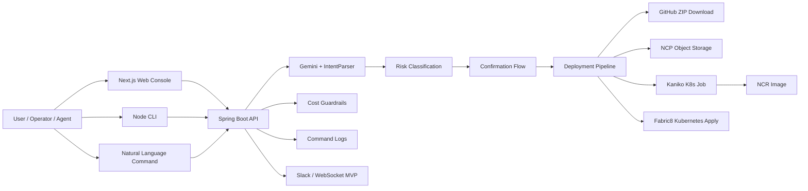

# K-Le-PaaS

K-Le-PaaS is an agent-safe Kubernetes control plane that converts natural language and CLI commands into auditable, risk-classified infrastructure operations.

K-Le-PaaS는 자연어와 CLI 명령을 감사 가능하고 위험도 분류된 Kubernetes 운영 작업으로 변환하는 Agent-safe PaaS control plane입니다.

## Overview

K-Le-PaaS connects Web, CLI, API, and natural language interfaces to a Spring Boot backend that deploys and operates Kubernetes applications. It is designed to avoid turning natural language directly into shell commands. Instead, requests are parsed into structured intents, classified by risk, logged, and executed through controlled backend services.

Core capabilities:

- GitHub OAuth login and GitHub App based repository access
- Repository registration and deployment configuration
- GitHub ZIP source download and repackaging
- NCP Object Storage upload
- Kaniko Kubernetes Job based image build
- NCR image push with commit-SHA image tags
- Fabric8 Kubernetes Client based Deployment, Service, and Ingress apply
- Natural language command parsing with Gemini 2.5 Flash
- LOW / MEDIUM / HIGH risk classification
- Human confirmation flow for risky commands
- Web console and Node based CLI control plane
- CLI cost planning, diff, explanation, and budget checks
- Slack and WebSocket deployment notification MVPs
- GitHub push webhook based auto-deploy MVP

## Current Status

| Area | Status | Notes |
|---|---|---|
| Web console | ✅ MVP | Next.js frontend with dashboard, deployments, GitHub, command, monitoring, and settings UI |
| Backend API | ✅ MVP | Spring Boot backend with auth, deployment, NLP, cost, webhook, and CLI auth APIs |
| GitHub OAuth | ✅ | OAuth code exchange and JWT issuing are implemented |
| GitHub App source access | ✅ MVP | Installation token flow and source ZIP download are implemented |
| NCP Object Storage upload | ✅ MVP | AWS SDK v2 S3-compatible upload path is implemented |
| Kaniko image build | ✅ MVP | Kubernetes Job build path is implemented |
| Kubernetes deploy | ✅ MVP | Fabric8 server-side apply for Deployment, Service, and Ingress |
| Commit SHA image tags | ✅ | Images are tagged with shortened commit SHA |
| Natural language operations | ✅ MVP | Gemini client, intent parser, dispatcher, command log, and confirmation flow are implemented |
| Risk confirmation | ✅ MVP | MEDIUM / HIGH risk commands require confirmation |
| CLI | ✅ MVP | `auth`, `ask`, `confirm`, `history`, `deployments`, `cost`, and `doctor` exist |
| Cost guardrails | ✅ MVP | Spec-based estimate, diff, explain, and budget check APIs/CLI exist |
| Slack notification | ✅ MVP | Incoming webhook notification service exists; environment setup is required |
| WebSocket deployment events | ✅ MVP | Authenticated WebSocket endpoint and deployment update publisher exist |
| GitHub webhook | ✅ MVP | Push webhook signature verification and deployment trigger exist |
| Scaling history | ✅ MVP | Scale operations persist and expose history |
| Deployment logs | ⚠️ Partial | Backend endpoint currently returns a placeholder response |
| Monitoring metrics | ⚠️ Partial | Frontend UI exists; backend metrics APIs are not implemented |
| MCP connector | 🚧 Planned | Frontend stubs/design direction only |
| IaC / Terraform | 🚧 Planned | Future design direction only; no Terraform/OpenTofu implementation is currently included |

## Architecture



## Interfaces

### Web

The frontend provides a browser console for authentication, repository registration, natural language commands, deployments, settings, and monitoring-oriented UI.

```bash
cd frontend
npm install
npm run dev
```

Default local URL:

```text
http://localhost:3000
```

### Backend

The backend is the main control plane. It owns authentication, deployment orchestration, NLP command handling, risk confirmation, cost estimation, CLI auth, WebSocket notification, and webhook handling.

```bash
cd backend
./gradlew bootRun
```

Default local URL:

```text
http://localhost:8080
```

### CLI

The CLI is intended for operators, automation, and agents that need structured output and stable exit codes.

```bash
cd frontend
npm run cli -- --help
npm run cli -- doctor
npm run cli -- auth login --web
npm run cli -- ask "default namespace pods 보여줘"
npm run cli -- confirm <commandLogId> --yes
npm run cli -- deployments list --repository-id 1 --json
npm run cli -- deployments wait <deploymentId> --timeout 600
npm run cli -- cost check --file docs/examples/cli-cost-spec.json --max-monthly 120000
```

Supported CLI environment variables:

```text
KLEPAAS_BASE_URL
KLEPAAS_TOKEN
KLEPAAS_REFRESH_TOKEN
```

See [CLI_REFERENCE.md](docs/CLI_REFERENCE.md) for the command reference.

## Safety Model

K-Le-PaaS classifies operational commands before execution.

| Risk | Examples | Behavior |
|---|---|---|
| LOW | list, status, overview, logs, cost estimate | Execute immediately |
| MEDIUM | restart, scale, non-destructive configuration change | Require confirmation |
| HIGH | deploy, rollback, delete, destructive infrastructure change | Require confirmation with target and impact summary |

Rules for users and agents:

- Do not bypass confirmation for MEDIUM or HIGH risk operations.
- Prefer explicit deployment IDs and repository IDs over guessed names.
- Use `--json` for automation.
- Treat command logs as the audit trail.
- Use immutable image tags such as commit SHA for deployment tracking.
- Treat MCP and IaC/Terraform integration as planned directions unless implemented in code.

## Cost Awareness

K-Le-PaaS currently provides spec-based cost estimation rather than real billing API integration.

Available CLI/API flows:

- `cost plan`: estimate planned monthly cost
- `cost diff`: compare current and planned specs
- `cost explain`: show cost breakdown and assumptions
- `cost check`: fail automation when a budget limit is exceeded

This is intended to make cost visible before deployment. Future IaC workflows may add Terraform/OpenTofu plan parsing, Infracost, and policy checks.

## Environment

Backend environment variables are usually configured in `backend/.env`.

Common backend settings:

```env
GITHUB_CLIENT_ID=
GITHUB_CLIENT_SECRET=
GITHUB_REDIRECT_URI=http://localhost:3000/console/auth/callback

GITHUB_APP_ID=
GITHUB_APP_PRIVATE_KEY=
GITHUB_APP_SLUG=

NCP_ACCESS_KEY=
NCP_SECRET_KEY=
NCP_STORAGE_BUCKET=
NCR_ENDPOINT=

K8S_NAMESPACE=default
K8S_IMAGE_PULL_SECRET=ncp-cr
KANIKO_IMAGE=gcr.io/kaniko-project/executor:latest

GEMINI_API_KEY=
GEMINI_MODEL=gemini-2.5-flash

JWT_SECRET=
SLACK_WEBHOOK_URL=
GITHUB_WEBHOOK_SECRET=
```

Frontend environment variables are usually configured in `frontend/.env.local`.

```env
NEXT_PUBLIC_API_URL=http://localhost:8080
NEXT_PUBLIC_WS_URL=ws://localhost:8080
NEXT_PUBLIC_APP_BASE_PATH=/console
```

Do not commit secrets.

## Verification

Run what is available in your local environment:

```bash
cd backend
./gradlew test
./gradlew build
```

```bash
cd frontend
npm ci
npm run build
npm run cli -- doctor
```

Kubernetes deployment checks:

```bash
kubectl get jobs,pods,deploy,svc,ingress -n <namespace>
kubectl rollout status deployment/<deployment-name> -n <namespace>
```

## Documentation

- [Backend README](backend/README.md)
- [Frontend README](frontend/README.md)
- [CLI Strategy](docs/CLI_STRATEGY.md)
- [CLI Reference](docs/CLI_REFERENCE.md)
- [CLI cost example](docs/examples/cli-cost-spec.json)

Internal planning notes, detailed status matrices, local roadmap drafts, and non-public design notes are kept under `.local/` and excluded by `.git/info/exclude`.
