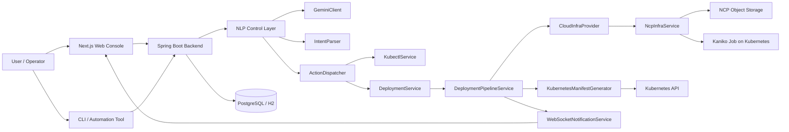

# KLEPaaS

> 자연어 기반 쿠버네티스 자동화 플랫폼  
> 사용자의 의도를 자연어로 해석하고, 위험도를 판별한 뒤, Kubernetes API와 배포 파이프라인으로 안전하게 연결하는 AI-first control plane

## Project Overview

KLEPaaS의 핵심 가치는 `kubectl`과 CI/CD 파이프라인을 사람이 직접 조합하던 운영 부담을, `의도 해석 -> 안전성 판단 -> 실행` 흐름으로 재구성한 데 있다.

- 자연어 명령을 곧바로 셸로 변환하지 않는다.
- 먼저 `Intent`와 인자를 구조화하고, `LOW / MEDIUM / HIGH` 리스크를 분류한다.
- 고위험 작업은 확인 절차를 거친 뒤 실행한다.
- 배포는 GitHub 소스, 이미지 빌드, Kubernetes 배포를 하나의 백엔드 파이프라인으로 연결한다.

즉, 이 프로젝트는 "AI 챗봇"이 아니라, 자연어를 운영 제어면으로 끌어올리기 위한 플랫폼 백엔드 설계에 더 가깝다.

## Why This Project Matters

쿠버네티스는 강력하지만, 초급 개발자나 작은 팀에게는 다음 문제가 반복된다.

- 배포, 재시작, 스케일링, 로그 조회가 서로 다른 도구와 문맥에 흩어져 있다.
- `kubectl` 명령은 빠르지만 실수 비용이 크고, 확인 절차가 없다.
- 클라우드 의존적인 빌드 경로와 이미지 레지스트리 설정은 재사용하기 어렵다.

KLEPaaS는 이를 다음 방식으로 줄이려 했다.

- 자연어를 API 계약으로 바꿔 운영 명령을 표준화한다.
- 위험 명령은 백엔드 정책으로 통제한다.
- 클라우드 인프라 의존성은 `CloudInfraProvider` 아래로 내린다.
- UI, CLI, 자동화 도구가 같은 백엔드 제어면을 공유하게 만든다.

## Current Implementation Status

기준 시점은 2026-03-12이며, 현재 활성 백엔드는 Python이 아니라 Spring Boot 기반 Java 구현이다. 현재 리포지토리의 핵심 실행 경로에서 Python 서비스는 보이지 않으며, Java 리팩토링은 "시작 단계"가 아니라 "핵심 플로우 이관 완료 단계"로 보는 편이 정확하다.

| 영역 | 상태 | 판단 |
|------|------|------|
| Java 리팩토링 | 높음 | 인증, 배포, NLP, 비용 추정, WebSocket, CLI 인증까지 Java 백엔드에 존재 |
| Kubernetes API 연동 | 높음 | Fabric8 기반 조회, 배포, 스케일, Kaniko Job 생성, server-side apply 구현 |
| 자연어 명령 해석 | 높음 | Gemini 호출, JSON 파싱, Intent 디스패치, 리스크 분류, 확인 플로우 구현 |
| 멀티 클라우드 확장성 | 중간 | 추상화는 준비됐지만 실제 구현체는 NCP 중심 |
| 운영 가시성 | 중간 | WebSocket 알림은 존재하나 로그 스트리밍과 메트릭 집계는 아직 얕음 |
| 성능 계측 | 낮음 | 비용/응답 구조는 있으나 README에 실측 수치를 넣을 공식 벤치마크는 아직 없음 |

### Readiness Review

#### 1. Kubernetes API 연동부

문서화는 충분히 가능하다. 특히 아래는 구현 근거가 명확하다.

- `KubernetesManifestGenerator`가 `Deployment`, `Service`, `Ingress`를 `serverSideApply()`로 반영
- `NcpInfraService`가 Kaniko Job을 생성하고 빌드 상태를 polling
- `KubectlService`가 Pods, Services, Ingresses, Namespaces, Endpoints, Deployment detail, Pod logs 조회를 담당
- `DeploymentPipelineService`가 업로드, 빌드, 배포, 성공/실패를 비동기 파이프라인으로 오케스트레이션

다만 README에서 "완전한 운영 플랫폼"처럼 쓰면 과장이다. 아래는 아직 남아 있다.

- `DeploymentService.getDeploymentLogs()`는 placeholder 응답
- HPA, 메트릭 서버, Prometheus 연동은 아직 본격화되지 않음
- `CloudVendor` enum은 AWS, ON_PREMISE를 열어두었지만 구현체는 NCP 중심

#### 2. 자연어 처리 커맨드 해석 로직

이 역시 문서화는 충분한 수준이다.

- `GeminiClient`가 직접 Gemini REST API를 호출
- `IntentParser`가 코드블록 포함 JSON 응답을 복원
- `ActionDispatcher`가 Intent를 실제 서비스 호출로 매핑
- `NlpCommandService`가 세션, 명령 로그, 확인 플로우를 관리
- `ConversationSession`을 DB에 저장해 상태를 서버에서 추적

하지만 "모델 품질 보장"까지 주장하기에는 근거가 부족하다.

- 평가 데이터셋 기반 정확도 지표가 없다
- confidence calibration 전략이 없다
- rule-based fallback이나 semantic guardrail은 아직 얕다

정리하면, 현재 NLP는 "시연 가능한 제품 수준"이며 "정량 검증까지 끝난 모델 운영 체계"는 아니다.

## Architecture



### Architectural Reading

- 프론트엔드와 CLI는 별도 비즈니스 로직을 갖지 않고 백엔드 제어면을 재사용한다.
- NLP 계층은 "자연어 -> 실행"을 직접 연결하지 않고 "자연어 -> 구조화된 Intent -> 정책 적용 -> 실행" 단계로 끊는다.
- 배포 파이프라인은 클라우드별 구현을 `CloudInfraProvider`로 감싼다.
- Kubernetes 리소스 반영은 CLI shell-out이 아니라 Fabric8 기반 API 호출로 구현한다.

## Technical Challenges & Decisions

### 1. Why Python -> Java

현재 코드베이스만 놓고 보면, Java 전환의 타당성은 충분하다. 이 판단은 리포지토리에 남아 있는 구조적 증거를 기준으로 한다.

**문제**

- 인증, 배포, NLP, WebSocket, CLI 인증, 비용 추정이 한 제품 안에서 강하게 연결된다.
- Python으로 빠르게 시작하는 것은 유리하지만, 도메인 규모가 커질수록 DTO, 예외 계약, 트랜잭션, 보안 필터, 타입 추론이 분산되기 쉽다.

**조치**

- Spring Boot 기반으로 인증, 배포, NLP, WebSocket, 비용 계산을 단일 런타임에 수렴
- JPA Entity, DTO, Security Filter, Controller, Service 계층으로 계약을 명시화
- `CreateDeploymentRequest`, `ParsedIntent`, `BuildResult`, `CostEstimateResponse` 같은 타입 중심 경계 도입

**결과**

- 기능 추가보다 "흐름 통제"가 중요한 플랫폼 백엔드에서 타입 안정성과 계층 경계가 더 분명해졌다.
- 위험 명령 확인, 비동기 파이프라인, 알림, 감사성 있는 명령 로그를 한 프레임 안에서 관리하기 쉬워졌다.
- 테스트 작성 지점도 함수 단위가 아니라 서비스 계약 단위로 선명해졌다.

#### 전환 논리

- 성능: 다중 API 호출, 보안 필터, 직렬화/역직렬화, WebSocket, 배포 오케스트레이션을 한 프로세스에서 안정적으로 다루기 좋다.
- 타입 안정성: 자연어 결과를 바로 실행하지 않고 구조화된 DTO와 enum으로 제한할 수 있다.
- 생태계: Spring Security, JPA, Validation, WebSocket, Swagger, Fabric8가 제어면 구축에 잘 맞는다.
- 운영성: 예외 처리, 트랜잭션, 빈 교체, 환경 분리가 체계적이다.

### 2. Why Fabric8 Instead of Shelling Out to kubectl

**문제**

- `kubectl` 셸 실행은 빠르지만 입력 검증, 응답 구조화, 권한 통제, 재시도 전략을 코드 안에 녹이기 어렵다.

**조치**

- Kubernetes 조회와 리소스 반영을 Fabric8 클라이언트로 통일
- `KubectlService`는 조회형 API를 제공하고, `KubernetesManifestGenerator`는 반영형 API를 담당

**결과**

- 프론트엔드와 CLI가 구조화된 응답을 공유할 수 있게 됐다.
- 자연어 명령이 실제로는 Kubernetes API 호출로 귀결되므로, 문자열 명령 생성보다 안전하다.

### 3. Why Kaniko Job Instead of Cloud Build Service Lock-in

**문제**

- 클라우드 빌드 서비스에 과도하게 묶이면, 소스 staging 방식과 빌드 컨텍스트 전달 방식이 플랫폼 설계를 제약한다.

**조치**

- GitHub ZIP을 받아 Object Storage에 올리고, Kubernetes 내부의 Kaniko Job이 이미지 빌드를 수행하도록 설계
- `initContainer`가 소스를 내려받고, Kaniko가 `/workspace`를 컨텍스트로 빌드

**결과**

- 빌드 경로를 쿠버네티스 내부로 밀어 넣어 클라우드별 차이를 줄였다.
- 레지스트리 교체나 멀티 클라우드 확장 시 build contract를 유지하기 쉬워졌다.

### 4. NCP Dependency Isolation and Multi-cloud Design

멀티 클라우드 관점에서 가장 중요한 포인트는 "NCP를 지원한다"가 아니라, "NCP를 어디에 가둬뒀는가"다.

현재 설계에서 긍정적인 지점은 다음과 같다.

- `CloudInfraProvider`가 업로드, 빌드 트리거, 빌드 상태 조회를 추상화
- `CloudInfraProviderFactory`가 `CloudVendor`에 따라 구현체를 바인딩
- 비용 계산도 `CloudVendor` 축을 따라 분기한다

아직 남은 한계도 분명하다.

- `CloudVendor`에 선언된 `AWS`, `ON_PREMISE` 구현체가 실제로는 부재
- `KubernetesManifestGenerator`는 여전히 단일 K8s 클러스터 가정을 많이 갖고 있다
- 레지스트리 인증, 네트워크, 스토리지 스펙이 NCP 친화적으로 표현돼 있다

따라서 README에서는 "멀티 클라우드 완성"이 아니라 아래처럼 쓰는 것이 맞다.

> NCP 우선 구현이지만, 클라우드 의존성을 `CloudInfraProvider` 아래로 격리해 AWS/EKS, 온프레미스 클러스터로 확장 가능한 구조를 먼저 확보했다.

## Problem - Action - Result

### 1. 자연어 명령을 안전한 운영 명령으로 바꾸기

**Problem**

자연어 명령은 편하지만, 운영 시스템에서는 모호성과 오탐이 치명적이다.

**Action**

- Gemini 응답을 자유 텍스트로 쓰지 않고 JSON Intent로 제한
- `IntentParser`로 구조 복원
- `ActionDispatcher`로 허용된 동작만 매핑
- `RiskLevel`로 고위험 작업에 확인 단계를 강제

**Result**

- "AI가 임의의 명령을 실행한다"는 인상을 줄이고, 제약된 control plane으로 설계 방향을 명확히 했다.

### 2. GitHub 소스부터 Kubernetes 배포까지 한 흐름으로 묶기

**Problem**

저장소, 빌드, 이미지 레지스트리, 클러스터 배포가 각각 따로 움직이면 상태 추적이 어렵다.

**Action**

- GitHub ZIP 다운로드
- Object Storage 업로드
- Kaniko Job 생성
- 빌드 상태 polling
- Kubernetes manifest apply

**Result**

- 배포를 단일 `Deployment` 도메인으로 추적할 수 있게 됐고, 실패 지점을 단계별로 나눠 설명할 수 있게 됐다.

### 3. UI와 CLI가 서로 다른 제품이 되지 않게 하기

**Problem**

웹 콘솔과 CLI가 각각 로직을 복제하기 시작하면 위험 정책과 응답 계약이 쉽게 어긋난다.

**Action**

- CLI를 thin client로 두고 백엔드 API를 재사용
- 위험 판단과 확인 정책은 백엔드에서 일원화

**Result**

- 사람 사용자, 자동화 스크립트, AI agent가 같은 제어면을 공유하는 구조가 됐다.

## Performance & Metrics

현재 리포지토리에는 비용 추정과 파이프라인 제어는 구현돼 있지만, README에 넣을 만한 공식 성능 리포트는 아직 없다. 이 섹션은 실측값을 추가하기 위한 자리로 유지하는 것이 맞다.

### Placeholder Metrics

| Metric | Before | After | Notes |
|--------|--------|-------|-------|
| NLP command round-trip latency | TBD | TBD | Gemini 호출 포함 P50 / P95 |
| Deployment status propagation latency | TBD | TBD | 상태 변경 -> WebSocket 전달 |
| Build failure detection time | TBD | TBD | Pod early failure detection 전후 비교 |
| Cost estimation response time | TBD | TBD | 캐시 적용 시 비교 가능 |
| Session lookup latency | TBD | TBD | DB 기반 세션 vs Redis 재도입 검토 시 사용 |

### Suggested Measurement Topics

- `ConversationSession`을 DB에 둔 현재 구조와 Redis 재도입 시 응답 시간 차이
- WebSocket 기반 배포 상태 전파 지연
- 빌드 polling interval 조정 전후 사용자 체감 시간
- `ImageTagGenerator` 기반 commit SHA tagging 도입 이후 롤백 추적성 개선

## Documentation Value for Interviewers

이 프로젝트를 면접관에게 설명할 때 핵심은 "무엇을 만들었는가"보다 "어떤 고민을 코드 구조로 고정했는가"다.

- 자연어 명령을 그대로 실행하지 않고 Intent와 RiskLevel로 제한했다.
- `kubectl` 래퍼가 아니라 Kubernetes API 기반 제어면을 만들었다.
- NCP에 먼저 최적화했지만, 클라우드 의존성은 provider 계층으로 격리했다.
- 웹 UI, CLI, 자동화 도구가 같은 백엔드 계약을 공유하도록 설계했다.

## Verification Snapshot

- 백엔드 테스트: 2026-03-12 `./gradlew test` 통과
- 확인된 구현 포인트: Spring Boot 4.0.2, Fabric8 Kubernetes Client, WebSocket 배포 알림, Slack 알림 구현체, GitHub Webhook, 비용 추정 API
- 남은 공백: 실제 배포 로그 스트리밍, 정량 NLP 평가, 멀티 클라우드 구현체 확장, 메트릭 기반 성능 보고서

## Repository Structure

```text
klepaas_v2/
├── backend/    # Spring Boot control plane
├── frontend/   # Next.js console + Node CLI
├── docs/       # CLI 전략, CLI 레퍼런스, 예시 spec 문서
└── README.md
```

## Quick Start

```bash
# backend
cd backend
./gradlew bootRun

# frontend
cd frontend
npm install
npm run dev
```

추가 문서는 [docs/CLI_STRATEGY.md](docs/CLI_STRATEGY.md), [docs/CLI_REFERENCE.md](docs/CLI_REFERENCE.md)를 기준으로 보면 된다.
