# K-Le-PaaS Frontend

K-Le-PaaS 프론트엔드는 **AI-First Kubernetes PaaS**의 웹 콘솔입니다.  
개발자가 자연어와 Git 연동만으로 Kubernetes 클러스터에 애플리케이션을 배포·모니터링·롤백할 수 있도록 하는 **Next.js 기반 대시보드 UI**를 제공합니다.

---

## 🌐 주요 역할

- **대시보드**: 클러스터/배포 상태를 한눈에 보여주는 메인 화면
- **자연어 명령 콘솔**: "nginx 재시작해줘" 같은 문장을 Kubernetes 명령으로 변환해 실행
- **배포 모니터링**: 실시간 WebSocket 기반 배포 진행률·로그 스트리밍
- **GitHub 연동**: GitHub OAuth, 저장소 연결, 워크플로우 트리거/상태 조회
- **Slack/알림 설정**: 배포 성공/실패 알림 채널 설정

---

## 🖼 주요 화면 예시

### 대시보드

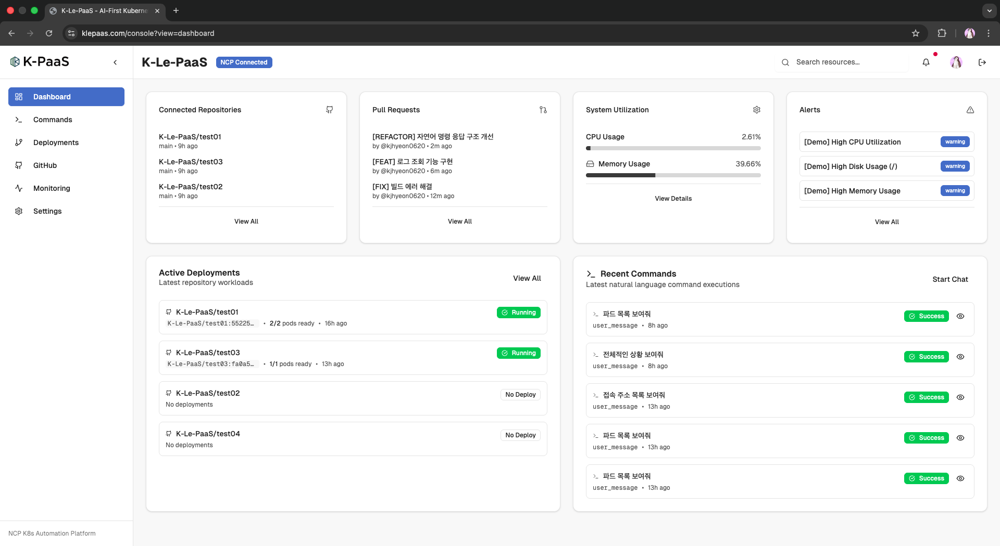

전체 클러스터 상태, 연결된 리포지토리, 최근 배포 및 자연어 명령 이력, 시스템 리소스 사용량을 한 화면에서 보여주는 메인 대시보드입니다.

### Deployments

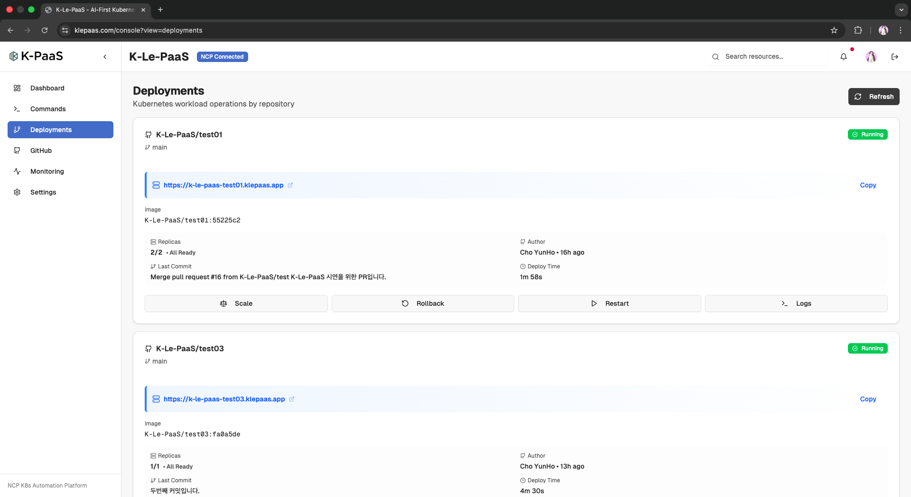

저장소별 배포 상태, 마지막 커밋 정보, 레플리카 수, Scale / Rollback / Restart / Logs 액션을 한 번에 관리하는 화면입니다.

### GitHub 통합 & 배포 모니터

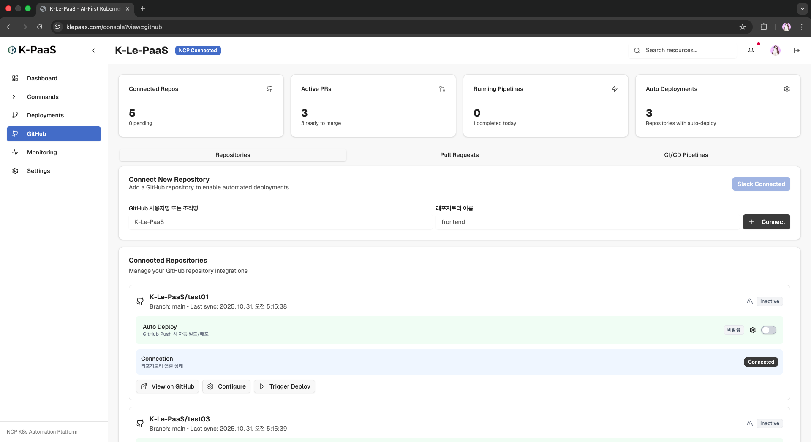

GitHub 저장소 연결 상태, 활성 PR, 자동 배포 설정, 파이프라인 실행 현황을 확인하고 수동 트리거를 실행하는 GitHub 통합 탭입니다.

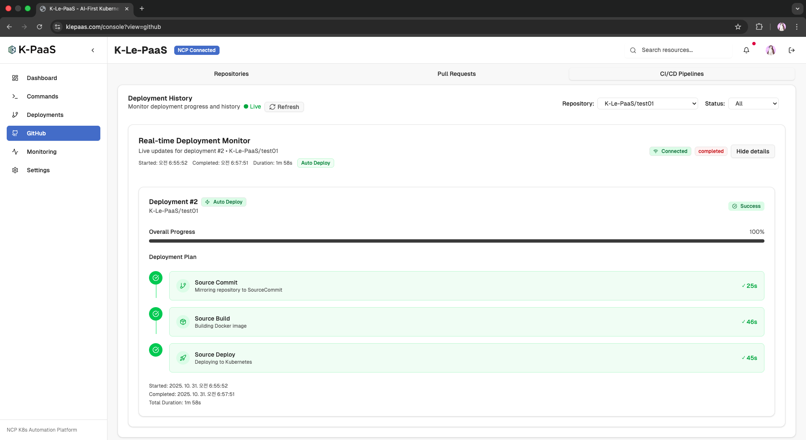

Source Commit → Source Build → Source Deploy 단계별 진행률과 소요 시간을 실시간으로 보여주는 배포 모니터 화면입니다.

### 실시간 클러스터 모니터링

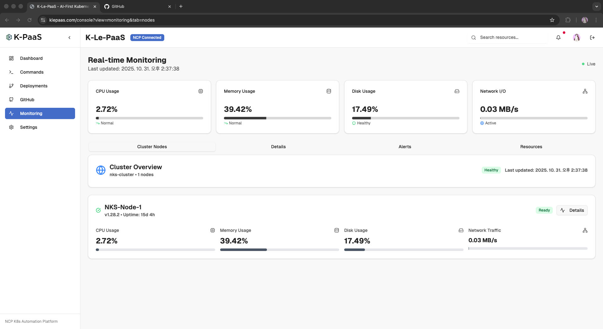

CPU/메모리/디스크/네트워크 I/O를 포함한 클러스터 노드 상태를 실시간으로 모니터링하는 화면입니다.

### 자연어 기반 롤백 워크플로우

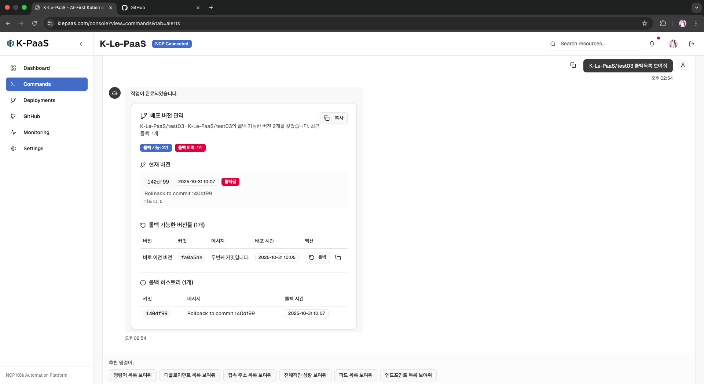

자연어 명령으로 특정 애플리케이션의 롤백 가능한 버전 목록을 조회하고, 각 버전에 대해 롤백을 실행할 수 있는 화면입니다.

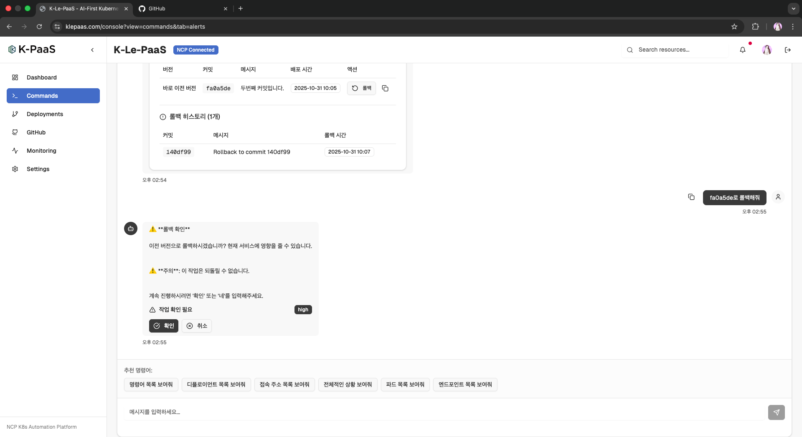

서비스 영향과 되돌릴 수 없음에 대한 경고를 보여주고, 사용자의 명시적인 확인을 요구하는 롤백 확인 단계입니다.

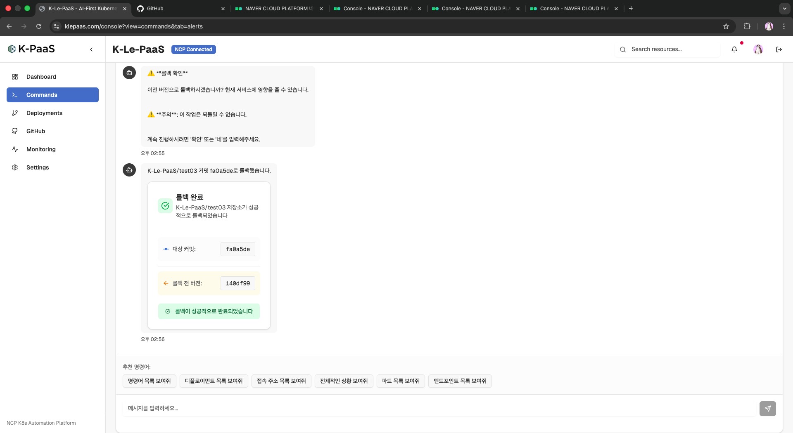

대상 커밋, 롤백 전 버전, 롤백 성공 여부를 요약해서 보여주는 롤백 완료 응답 화면입니다.

### 자연어 명령 콘솔

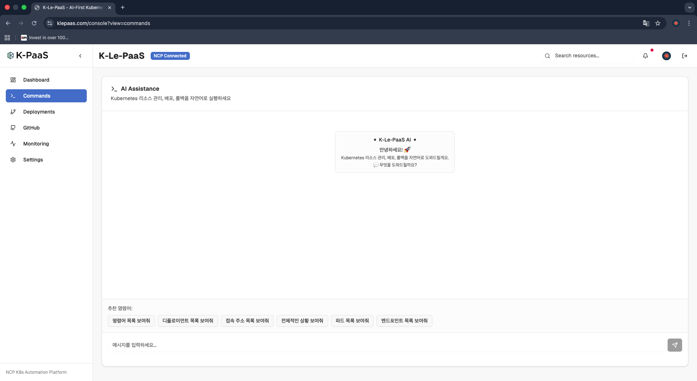

명령어 추천과 입력창만 보이는 초기 상태의 자연어 명령 콘솔 화면입니다.

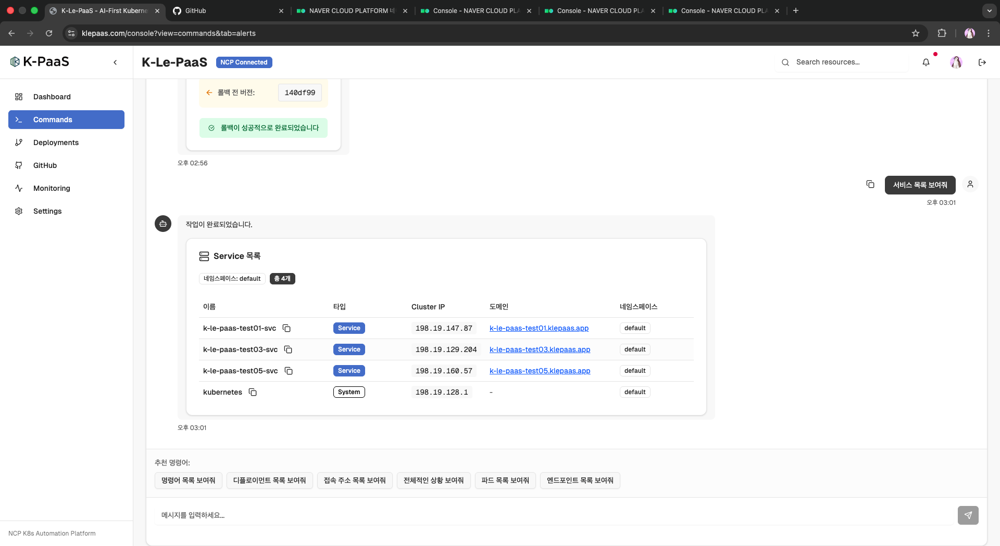

상태 조회나 리스트 조회 등 일반적인 명령이 성공했을 때의 응답 예시입니다.


### 인증 및 온보딩

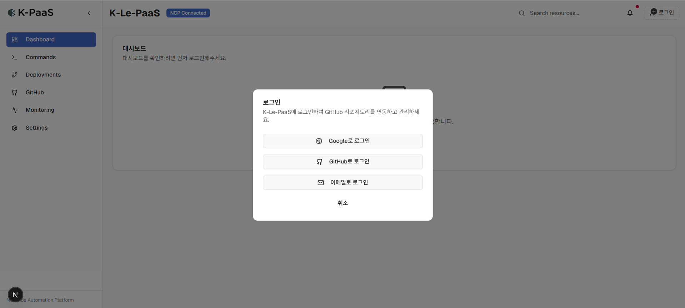

사용자가 K-Le-PaaS 콘솔에 처음 진입할 때 OAuth 인증을 안내하는 로그인/온보딩 화면입니다.


### Slack 알림 예시

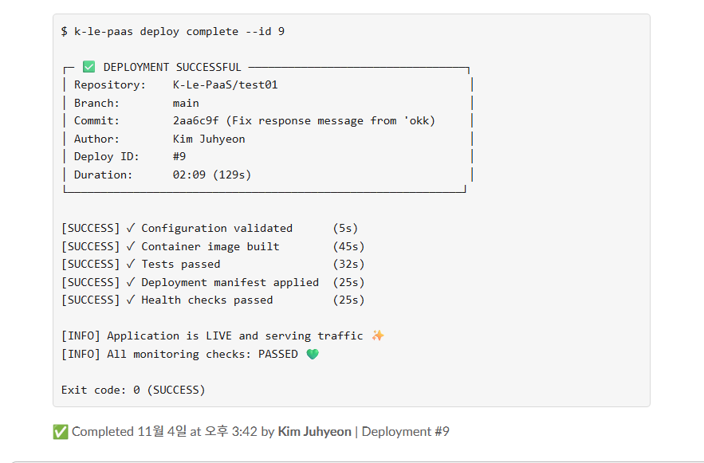

새 배포가 완료되었을 때 Slack 채널로 전송되는 알림 메시지 예시입니다.

---

## 🧱 기술 스택

- **프레임워크**
  - Next.js 15 (App Router, Server Components)
  - React 19
  - TypeScript 5

- **UI & 스타일**
  - Tailwind CSS 4
  - shadcn/ui (Radix UI 기반 컴포넌트)
  - Lucide React 아이콘
  - 커스텀 테마(`theme-provider.tsx`), 다크 모드 지원

- **데이터 & 통신**
  - REST API (`lib/api.ts`)
  - WebSocket (`hooks/use-global-websocket.ts`)
  - React Context (`contexts/auth-context.tsx`)

- **폼/검증 & 유틸**
  - React Hook Form, Zod
  - Recharts (대시보드 차트)
  - 각종 커스텀 훅 (`hooks/use-toast.ts`, `use-mobile.ts` 등)

---

## 📁 프로젝트 구조

> 상세한 아키텍처는 `docs/FRONTEND_ARCHITECTURE.md` 참고

```bash
frontend/
├── app/                     # Next.js App Router 엔트리
│   ├── layout.tsx           # 전체 레이아웃, 테마/글로벌 래퍼
│   ├── page.tsx             # 메인 콘솔 페이지
│   ├── auth/
│   │   └── callback/page.tsx        # OAuth2 등 인증 콜백
│   └── oauth2-callback/page.tsx     # 백엔드 OAuth 콜백 처리
│
├── components/
│   ├── dashboard-overview.tsx       # 대시보드 개요
│   ├── natural-language-command.tsx # 자연어 명령 입력/결과
│   ├── deployment-status-monitoring.tsx
│   ├── deployment-progress.tsx
│   ├── deployment-logs-dialog.tsx
│   ├── github-integration-panel.tsx # GitHub 연동 패널
│   ├── real-time-monitoring-dashboard.tsx
│   ├── realtime-deployment-monitor.tsx
│   ├── settings/                    # 설정 페이지 섹션
│   │   ├── SettingsPage.tsx
│   │   ├── AgentsBridgesSection.tsx
│   │   ├── EnvironmentsClustersSection.tsx
│   │   ├── MCPConnectorsSection.tsx
│   │   └── SlackNotificationsSection.tsx
│   ├── nlp-response-renderers/      # NLP 응답 타입별 렌더러
│   └── ui/                          # shadcn/ui 기반 공용 UI 컴포넌트
│
├── contexts/
│   └── auth-context.tsx             # 인증 상태 관리
│
├── hooks/
│   ├── use-global-websocket.ts      # 전역 WebSocket 연결 관리
│   ├── use-toast.ts                 # Toast 알림
│   └── use-mobile.ts                # 모바일 판별 훅
│
├── lib/
│   ├── api.ts                       # 백엔드 REST API 클라이언트
│   ├── config.ts                    # 환경별 설정 (API URL 등)
│   ├── types/
│   │   └── nlp-response.ts          # NLP 응답 타입 정의
│   └── utils/                       # 공통 유틸
│
├── docs/
│   ├── README.md                    # 프론트엔드 문서 인덱스
│   ├── FRONTEND_ARCHITECTURE.md     # 아키텍처 상세 문서
│   └── ENVIRONMENT_SETUP.md         # 환경 변수/빌드 관련 가이드
│
├── public/                          # 정적 리소스
├── styles/ or app/globals.css       # 전역 스타일
├── next.config.mjs                  # Next.js 설정
├── tailwind.config.js               # Tailwind 설정
└── package.json
```

---

## ⚙️ 로컬 개발 시작하기

### 1. 의존성 설치

```bash
cd frontend

# npm 사용
npm install

# 또는 pnpm/yarn을 쓰는 경우
# pnpm install
# yarn install
```

### 2. 환경 변수 설정

프로젝트 루트에 `.env.local` 파일을 생성하고, 최소한 다음 값을 설정합니다.  
(자세한 내용은 `docs/ENVIRONMENT_SETUP.md` 참고)

```bash
# 예시
NEXT_PUBLIC_API_URL=http://localhost:8000
NEXT_PUBLIC_WS_URL=ws://localhost:8000
NEXT_PUBLIC_APP_BASE_PATH=/console
```

> ⚠️ Next.js 환경변수는 **빌드 타임에 고정**되므로, 값 변경 후에는 `npm run dev`/`npm run build`를 다시 실행해야 합니다.

### 3. 개발 서버 실행

```bash
npm run dev
# 브라우저에서 http://localhost:3000 접속
```

### 4. 프로덕션 빌드 & 실행

```bash
# 빌드
npm run build

# 프로덕션 서버 실행
npm start
# 기본 포트: 3000
```

---

## 🔌 백엔드 연동

프론트엔드는 `backend-hybrid` FastAPI 백엔드와 통신합니다.

- **REST API**
  - 엔드포인트 정의: `backend-hybrid/app/api/v1/*`
  - 클라이언트: `frontend/lib/api.ts`
- **WebSocket**
  - 배포 모니터링: `/ws/deployments` (예: `use-global-websocket.ts`에서 사용)
- **OAuth2 / GitHub / Slack**
  - 인증 콜백: `app/auth/callback/page.tsx`, `app/oauth2-callback/page.tsx`
  - 상세 플로우: `backend-hybrid/docs/architecture/BACKEND_ARCHITECTURE.md` 참고

---

## 🧩 주요 화면/컴포넌트

- **메인 콘솔 페이지**: `app/page.tsx`
- **대시보드**: `components/dashboard-overview.tsx`
- **자연어 명령 콘솔**: `components/natural-language-command.tsx`
- **배포 모니터링**: `components/deployment-status-monitoring.tsx`, `realtime-deployment-monitor.tsx`
- **GitHub 통합 패널**: `components/github-integration-panel.tsx`
- **설정 페이지**: `components/settings/SettingsPage.tsx` 및 하위 섹션
- **공용 UI 라이브러리**: `components/ui/*`

---

## 🧭 개발 컨벤션 (요약)

- **타입스크립트 필수**: 모든 컴포넌트/함수에 명시적 타입 지향
- **컴포넌트 분리**: 도메인 컴포넌트는 `components/`, 페이지는 `app/`
- **스타일링**: Tailwind CSS + shadcn/ui 컴포넌트 우선 사용
- **상태 관리**:
  - 로컬 상태: React `useState`, `useReducer`
  - 전역 상태: Context + custom hook (`auth-context`, `use-global-websocket` 등)
- **API 호출**: `lib/api.ts`를 통해 캡슐화, 컴포넌트에서는 직접 fetch 호출 지양

자세한 규칙과 설계 철학은 다음 문서를 참고하세요.

- `docs/FRONTEND_ARCHITECTURE.md`
- `docs/ENVIRONMENT_SETUP.md`
- `backend-hybrid/docs/architecture/BACKEND_ARCHITECTURE.md`

---

## 🤝 기여

1. 이슈 또는 작업 내용 정의
2. 브랜치 생성: `feat/…`, `fix/…` 형식
3. 기능 구현 + 테스트
4. 관련 문서(`docs/…`) 및 이 README 내용이 필요 시 업데이트되었는지 확인
5. PR 생성 시 변경된 화면 스크린샷/설명 추가

---


